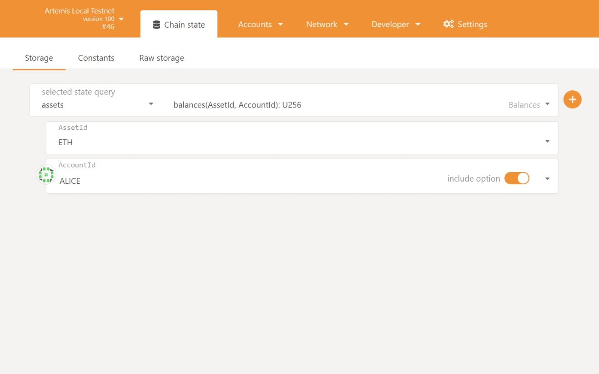
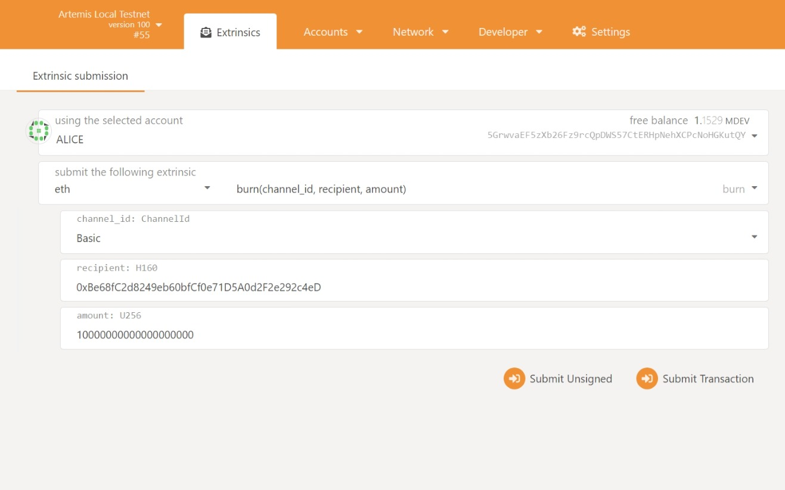

# E2E tests

The E2E tests run against local deployments of the parachain, relayer and ganache.

## Requirements

1. Development environment for Rust and Substrate. See parachain [requirements](../parachain/README.md#requirements).
2. Development environment for Ethereum smart contracts.

   ```bash
   yarn global add truffle
   (cd ../ethereum && yarn install)
    ```

3. Development environment for Relayer. See relayer [requirements](../relayer/README.md#requirements).
4. `timeout` - native package on Ubuntu, on macOS try ```brew install coreutils```
5. `jq` - https://stedolan.github.io/jq/download/
5. Build the `@snowfork/snowbridge-types` package using these [steps](../types/README.md#development).

## Setup

Download dependencies:

```bash
yarn install

# Build typescript bindings
cd ./node_modules/@snowfork/snowbridge-types && yarn install
```

Install `polkadot-launch`:

```bash
git clone -n https://github.com/snowfork/polkadot-launch.git /tmp/polkadot-launch
cd /tmp/polkadot-launch
yarn install
yarn build
yarn global add file:$(pwd)
```

Build polkadot:

```bash
git clone -n https://github.com/snowfork/polkadot.git /tmp/polkadot
cd /tmp/polkadot
git checkout enable_beefy_on_rococo
cargo build --release
```

Create your test env file and set the directory where you installed the polkadot binary:
```bash
cp ./.env-example .env
```

Start all services (parachain, relayer, ganache, etc):

```bash
scripts/start-services.sh
```

Wait until the "System has been initialized" message

Go to polkadot-js and wait until the parachain has started producing blocks:
https://polkadot.js.org/apps/?rpc=ws%3A%2F%2F127.0.0.1%3A11144#/explorer

Confirm the block number is > 2

You should now be good to go!

## Run Tests

### Integration Tests

```bash
yarn test
```

### Manual Tests

Make sure to setup the E2E stack as described above.

For interacting with Substrate, open [https://polkadot.js.org/apps/](https://polkadot.js.org/apps/?rpc=ws%3A%2F%2Flocalhost%3A11144#/explorer) in your browser (Make sure to use this link specifically).

#### Locking up ETH to mint PolkaETH on Substrate

Send 10 Ether to `//Alice` on Substrate:

```bash
cd ../ethereum
truffle exec scripts/sendEth.js 10 \
  0xd43593c715fdd31c61141abd04a99fd6822c8558854ccde39a5684e7a56da27d \
  --network e2e_test
```

It should take around 10-20 seconds for Substrate to receive and process the message.

In the substrate webapp (linked above), you should see an `Eth.Minted` event in the Network > Explorer view.

#### Burning PolkaETH to unlock ETH on Ethereum

To see the PolkaETH balance for `//Alice`:

1. Navigate to Developer > Chain state > Storage
2. Select the `assets` module in the drop-down.
3. Select `ETH` as the AssetId
4. Select `Alice` as the AccountId
5. Click the `+` button



To burn PolkaETH and unlock ETH on Ethereum:

1. Navigate to Developer > Extrinsics
2. Select `Alice` as the AccountId
3. Select `eth` as the module, and `burn` as the extrinsic
4. Select `Basic` for the ChannelId
5. Input `0xBe68fC2d8249eb60bfCf0e71D5A0d2F2e292c4eD` for the recipient
6. Input `10000000000000000000` for the amount



It should take around 20 seconds for Ethereum to receive and process the message.

To verify that `0xBe68fC2d8249eb60bfCf0e71D5A0d2F2e292c4eD` received 10 Ether:

```bash
cd ../ethereum
truffle exec scripts/getEthBalance.js 0xBe68fC2d8249eb60bfCf0e71D5A0d2F2e292c4eD --network e2e_test
```

## Debugging

The `start-services.sh` script writes the following logs:

- parachain.log
- relayer.log
- ganache.log
